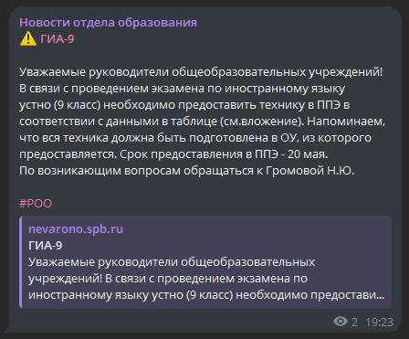

# Neva Edu Bot

**Neva Edu Bot**  - простой телеграм бот для чтения новостей информационного сайта отдела образования администрации Невского района Санкт-Петербурга прямиком из мессенджера. Реализует парсинг новостей с сайта и отправку постов со ссылкой на оригинал в необходимый телеграм канал.

### Пример публикации в телеграм канале

### TODO

- [ ] минимизировать количество зависимостей
- [ ] использовать оригинальную разметку у публикаций
- [ ] написаит нормальную ридмишку
